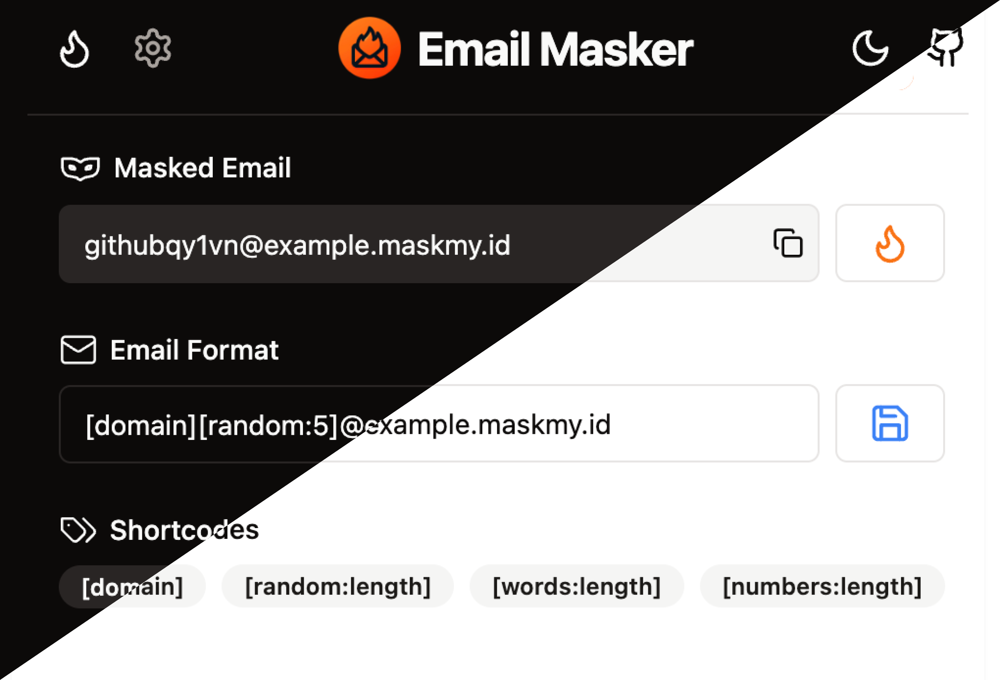
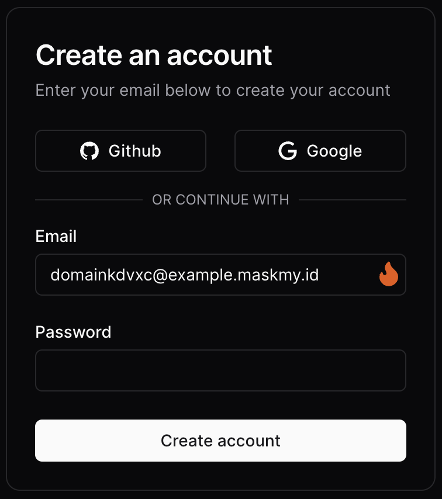

# Email Masker Browser Extension [](https://github.com/irazasyed/email-masker)

> Email Masker is an open-source browser extension that helps you generate and use masked email addresses for your online accounts using [Quick Aliases](https://dub.sh/quick-alias) powered by [Skiff Mail](https://skiff.com/mail?utm_content=readme&utm_medium=extension&utm_source=email_masker).
>
> It helps you protect your privacy and keep your inbox clean from spam.

Extension by [@irazasyed](https://github.com/irazasyed)

## Contents

- [Features](#features)
- [Supported Browsers](#supported-browsers)
- [Highlights](#highlights)
- [Email Format Templates](#email-format-templates)
- [Contributing](#contributing)
- [Security Vulnerabilities](#security-vulnerabilities)
- [Code of Conduct](#code-of-conduct)
- [License](#license)
- [Credits](#credits)
- [Disclaimer](#disclaimer)

## Features

**🔥 Customizable Masked Email Format**: Tailor your masked email format to your liking.

**📧 Quick Masked Email Generation**: Swiftly create masked email addresses via pop-up or on-page options.

**🏷️ Convenient Shortcodes**: Use domain, random strings/numbers, and random words in your email format.

**🗣️ Multilingual Support**: Enjoy the extension in multiple languages.

**🌐 Multi-Browser Compatibility**: Works on Chrome, Brave, Edge, and Firefox.

**🌙 Light & Dark Modes**: Choose your preferred interface theme.

**🖥️ Clean User Interface**: Minimalistic design for a focused experience.

**📂 Open-Source**: View and contribute to the source code.

**🔒 Privacy Assurance**: No data collection; generated emails are not stored.

## Supported Browsers

✅ Chrome / Brave / Edge

✅ Firefox

## Highlights

<table>
	<tr>
		<th width="60%">
			Popup
		</th>
		<th width="40%">
			On-Page
		</th>
	</tr>
	<tr><!-- Prevent zebra stripes --></tr>
	<tr>
		<td align="center">
            <b>Pop-up Preview with Dark/Light Mode</b><br>
            
		</td>
		<td align="center">
            <b>Flame icon in Email input field</b><br>
            
		</td>
	</tr>
</table>

## Email Format Templates

Email Masker supports the following shortcodes that you can use in your email format.

- `[domain]` - Primary domain name from the current website (normalized).
- `[random:length]` - Random Alphanumeric string of n characters.
- `[words:length]` - Random words of n length.
- `[numbers:length]` - Random numbers of n length.

### Templates

Here are some email format templates you can use based on your preference, you may customize as you like.

**Default**

A combination of `[domain]` and `[random:5]` is used as the default email format.

```
[domain][random:5]@example.maskmy.id
```

The above format will generate email addresses like `github29wun@example.maskmy.id`

**Random Strings**

```
[random:8]@example.maskmy.id
```

**Random Words**

```
[words:3]@example.maskmy.id
```

**Random Numbers**

```
[numbers:8]@example.maskmy.id
```

**Random Words and Numbers**

```
[words:2][numbers:4]@example.maskmy.id
```

**Random Words and Numbers (With Separator)**

```
[words:2]-[numbers:4]@example.maskmy.id
```

**Domain and Random Words**

```
[domain][words:2]@example.maskmy.id
```

**Prefix and Random Strings**

```
prefix-[random:8]@example.maskmy.id
```

## Contributing

Please see [CONTRIBUTING](CONTRIBUTING.md) for details.

## Security Vulnerabilities

Please see [SECURITY](.github/SECURITY.md) for details.

## Code of Conduct

Please see [CODE_OF_CONDUCT](CODE_OF_CONDUCT.md) for details.

## License

MIT

## Credits

- [Irfaq Syed](https://github.com/irazasyed)
- [All Contributors](../../contributors)

## Disclaimer

This project is not affiliated with, endorsed by, or sponsored in any way by Skiff.
